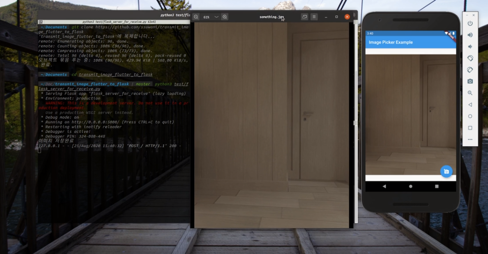

# transmit_image_app_to_server

## Requirements
- Flutter
- PIL(pip)
- Flask(pip)


## Usage
```code
python3 test/flask_server_for_receive.py
```
```code
flutter run
```

## Operation Video

[](https://youtu.be/Vz42rCPnWl8)

